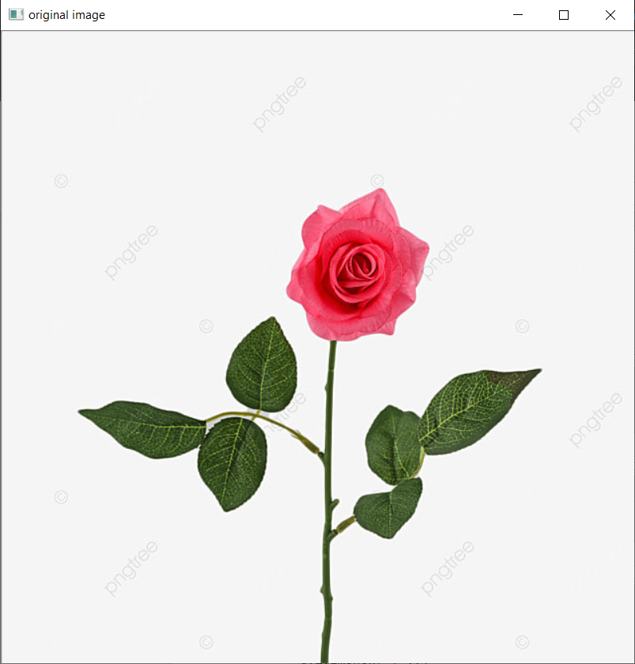
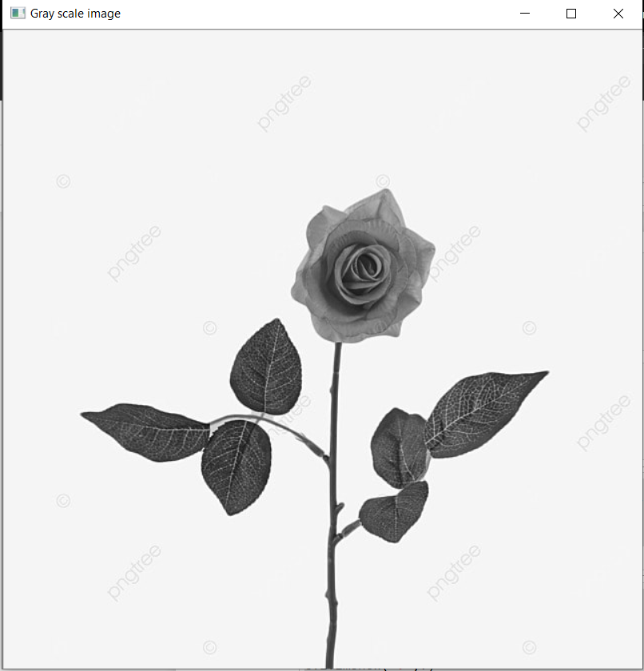
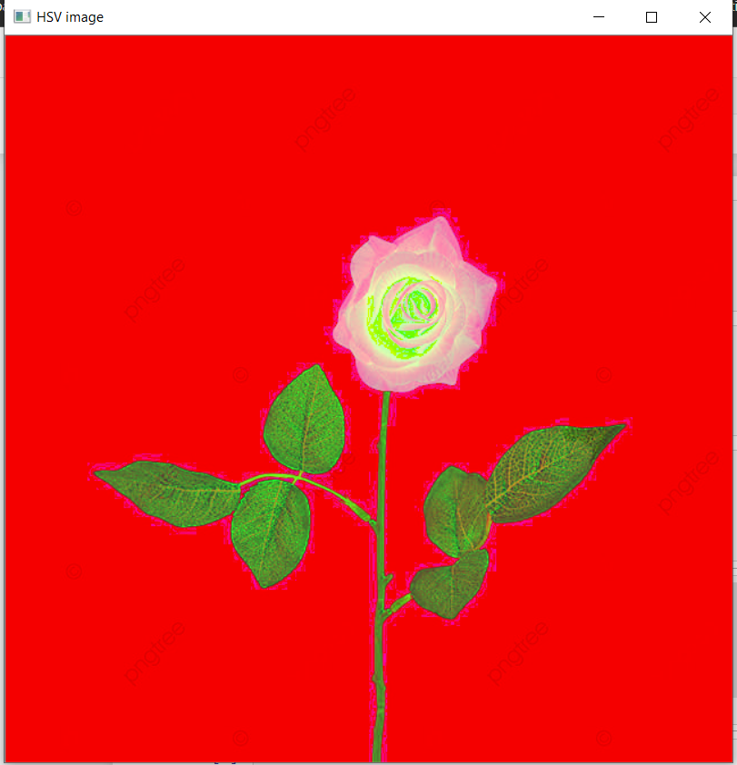
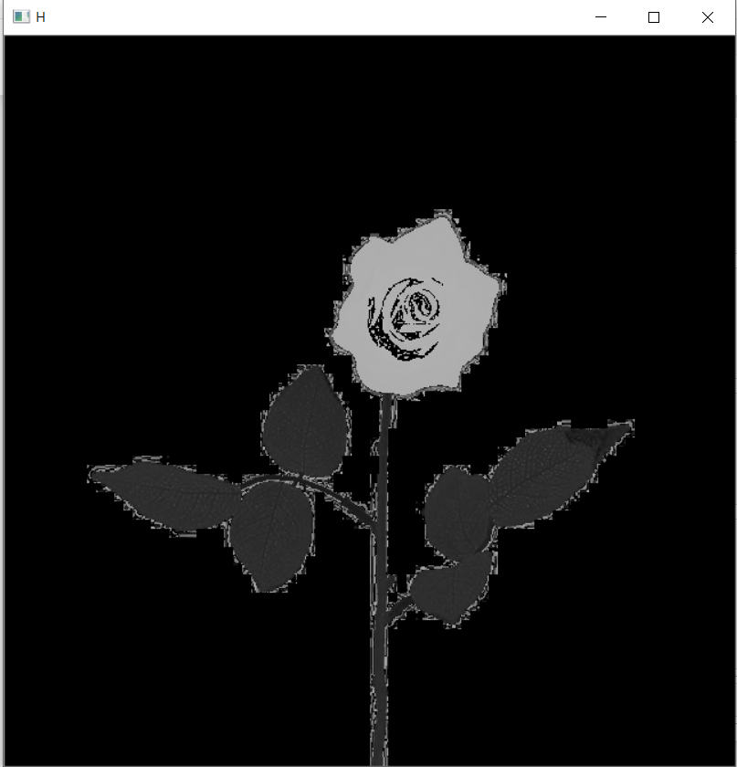
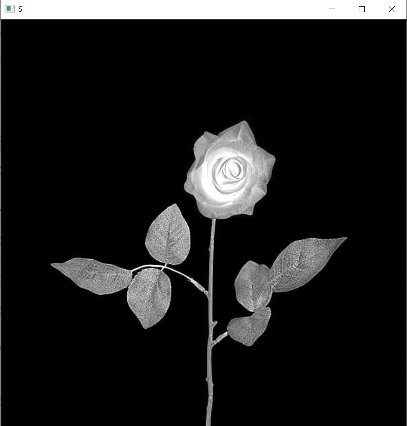
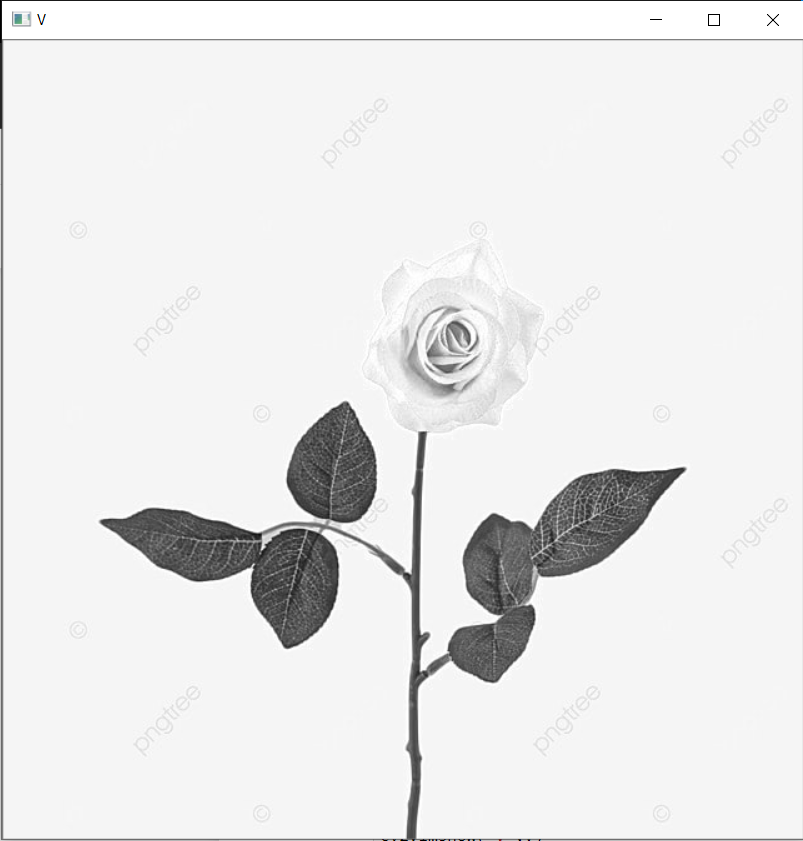

# Name : K.Balaji
# Resgister number : 212221230011
# Working-on-images
# Question:
### To work some image conversion operations on a image.
# Program:
```
#Original image
import cv2
img=cv2.imread('rose.jpg',1)
cv2.imshow('original image',img)
cv2.waitKey(0)
cv2.destroyAllWindows()


#Gray scale image
gray=cv2.cvtColor(img,cv2.COLOR_BGR2GRAY)
cv2.imshow('Gray scale image',gray)
cv2.waitKey(0)
cv2.destroyAllWindows()


#HSV image
hsv_image=cv2.cvtColor(img,cv2.COLOR_BGR2HSV)
cv2.imshow('HSV image',hsv_image)
cv2.waitKey(0)
cv2.destroyAllWindows()


#Display H,S and V
h,s,v=cv2.split(hsv_image)
cv2.imshow('H',h)
cv2.imshow('S',s)
cv2.imshow('V',v)
cv2.waitKey(0)
cv2.destroyAllWindows()
```
# Output:
## Original image:

## Gray scale image:

## HSV image

## H,S and V planes:


